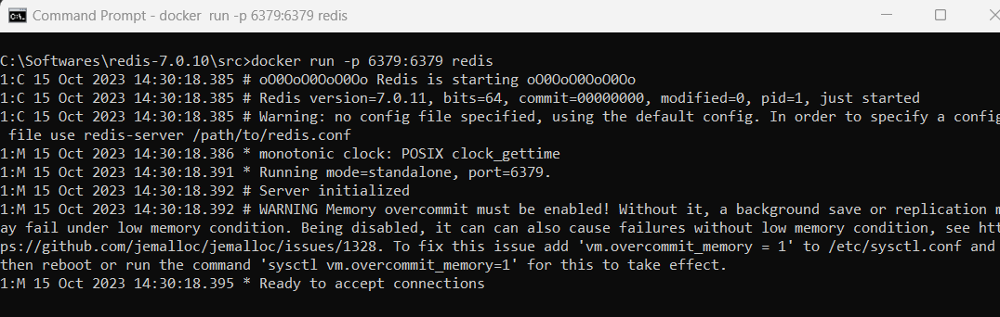
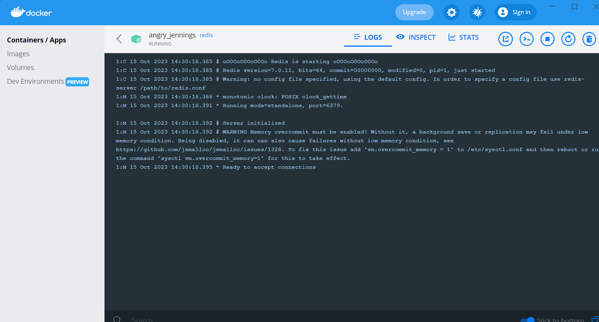

Connect to Redis server in local

1. Start Docker desktop on your local machine
2. Pull the redis image by running the command: docker pull redis
3. Start the container by mapping the container port to your local port. The syntax is docker -p 6379:6379 <imagename> i.e. docker -p 6379:6379 redis

4. Add the following in the application.properties file  
   spring.redis.host=localhost  
   spring.redis.port=6379
5. Start the springboot applicaiton and verify the rest endpoints  
   To set a value in Redis: POST http://localhost:8080/redis/set/myKey/myValue
   To get a value from Redis:   GET http://localhost:8080/redis/get/myKey
